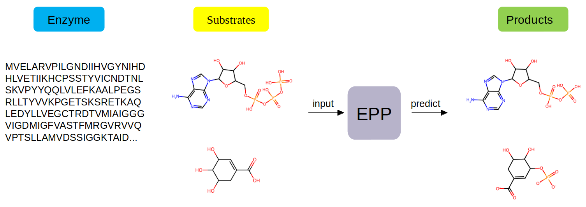
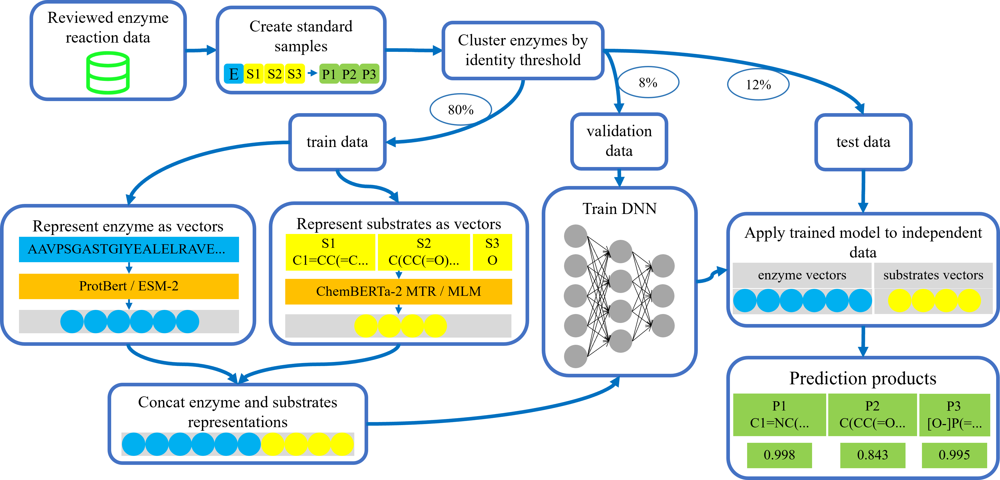
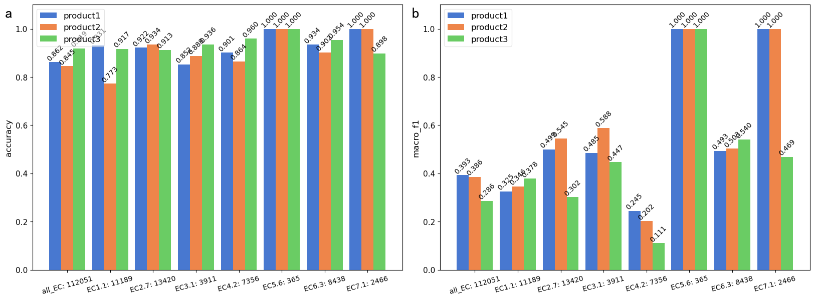

# EPP介绍

这个存储库包含了论文“A general deep learning model for predicting small molecule products of enzymatic reactions“的代码和数据集。

EPP是一个深度学习模型，可以根据酶序列和底物，直接预测酶催化产物，如下所示：



EPP模型的架构如下所示：



我们开发了两种EPP模型:EPP_39k(在39k数据上训练), EPP_151k(在151k数据上训练)。EPP_39k在独立测试数据上的预测效果如下：


EPP_39k在额外数据上的预测效果如下：



# 文件说明

这个存储库包含以下文件夹：

    ├── data
    ├── figures
    ├── model
    ├── notebooks_and_code
    ├── requirements.txt
    ├── README_EN.md
    └── README.md

所有代码都包含在"notebooks_and_code"文件夹中。所有生成的文件都在"data", "figures", and "model"文件夹中，分别包含了数据集，图片和训练的模型。

# 使用方式

## 环境要求

|          | 模型训练      | 模型预测      | 本文                                            |
| -------- | ------------- | ------------- | ----------------------------------------------- |
| 操作系统 | Linux/Windows | Linux/Windows | Linux                                           |
| 硬件     | GPU           | GPU/CPU       | GPU: 4*RTX4090<br />CPU: Xeon(R) Gold 6133 CPU |

## 环境安装

首先下载本仓库：

```shell
git clone https://github.com/Mingyang0018/EPP_predict.git
cd EPP
```

建议使用conda创建虚拟环境，然后激活环境。

```shell
conda create -n EPP python=3.10
conda activate EPP
```

然后安装python3, 推荐python 3.10。

安装torch和cuda, 模型训练使用了4个RTX4090, 推荐torch 2.3.1 + cuda 12.1，对于Linux/Windows，执行命令:

conda安装

```shell
conda install pytorch torchvision torchaudio pytorch-cuda=12.1 -c pytorch -c nvidia
```

或pip安装

```shell
pip3 install torch torchvision torchaudio --index-url https://download.pytorch.org/whl/cu121
```

然后使用 pip 安装依赖：

```shell
pip install -r requirements.txt
```

## 快速预测

如果想要使用EPP(EPP_151k)预测酶催化产物，执行命令：

```shell
python notebooks_and_code/code/model_prediction.py --path=<path_of_inputfile>
```

其中<path_of_inputfile>为输入文件，包含酶序列和底物信息，文件模板为data/data_input_template.xlsx。

## 网络APP

使用streamlit可以搭建EPP(EPP_151k)的网络APP，首先安装streamlit:

```shell
pip3 install streamlit
```

然后执行命令：

```shell
streamlit run notebooks_and_code/code/streamlit_app.py
```

# 引用

如果你觉得我们的工作有帮助，请考虑引用下列论文。

```
@article{yang2024EPP,
  title={EPP: A general deep learning model for predicting small molecule products of enzymatic reactions},
  author={Mingxuan Yang, Dong Men and others},
  journal={},
  year={2024}
}
```
