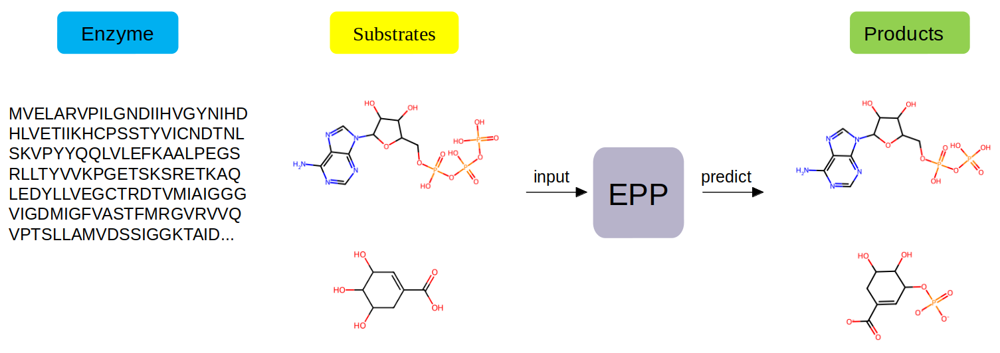
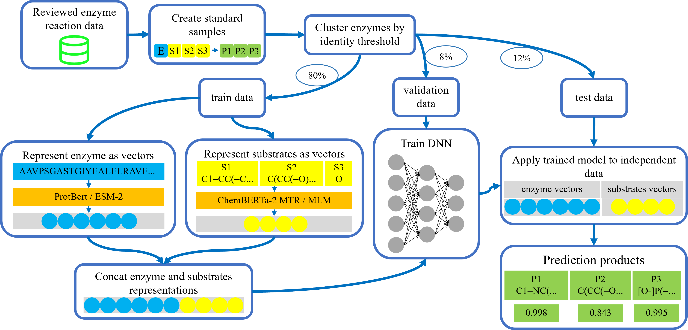
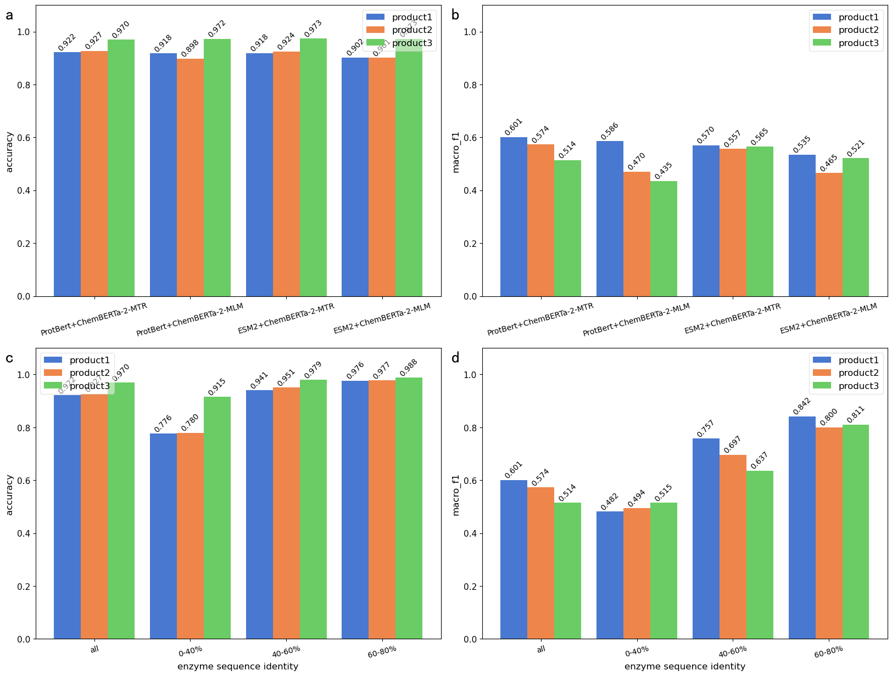
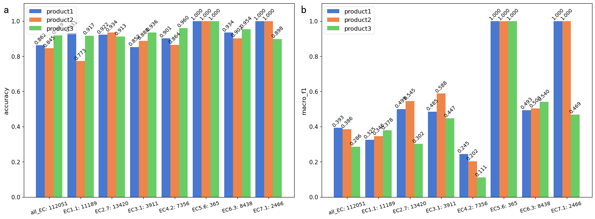

# EPP Introduction

This repository contains the code and dataset for the paper "A general deep learning model for predicting small molecule products of enzymatic reactions".

EPP is a deep-learning model, can directly predict the enzyme catalytic products based on enzyme sequences and substrates, as shown below:



The architecture of EPP model is as follows:



The prediction effect of EPP model on independent test data is as follows:



The prediction effect of EPP model on additional data is as follows:



# File Description

This repository contains the following folders:

    ├── data
    ├── figures
    ├── model
    ├── notebooks_and_code
    ├── requirements.txt
    ├── README_EN.md
    └── README.md

All code is included in the "notebooks_and_code" folder. All generated files are stored in the "data", "figures", and "model" folders, which contain the dataset, images, and trained models, respectively. All code is run on UBUNTU system.

# Usage

## Environment Requirements

|                 | Model training | Model prediction | Our paper                                       |
| --------------- | -------------- | ---------------- | ----------------------------------------------- |
| Operatin system | Linux/Windows  | Linux/Windows    | Linux                                           |
| Hardware        | GPU            | GPU/CPU          | GPU: 4*RTX4090<br />CPU: Xeon(R) Gold 6133 CPU |

## Environment Installation

First, download this repository:

```shell
git clone https://github.com/Mingyang0018/EPP_predict.git
cd EPP
```

It is recommended to use conda to create a virtual environment and activate it.

```shell
conda create -n EPP python=3.10
conda activate EPP
```

Install Python 3.10 or later.

Install torch and cuda, and the model training uses 4 RTX4090, recommend torch 2.3.1 + cuda 12.1:

conda installation

```shell
conda install pytorch torchvision torchaudio pytorch-cuda=12.1 -c pytorch -c nvidia
```

or pip installation

```shell
pip3 install torch torchvision torchaudio --index-url https://download.pytorch.org/whl/cu121
```

Then use pip to install dependencies:

```shell
pip install -r requirements.txt
```

## Quick Prediction

If you want to use EPP (EPP_151k) to predict enzyme catalytic products, run the following command:

```shell
python3 notebooks_and_code/code/model_prediction.py --path=<path_of_inputfile>
```

Where <path_of_inputfile> is the input data file containing enzyme sequences and substrate information, and the file template is data/data_input_template.xlsx.

## Web APP

Use streamlit to build a web app for EPP (EPP_151k). First, install streamlit:

```shell
pip3 install streamlit
```

Then run the following command:

```shell
streamlit run notebooks_and_code/code/streamlit_app.py
```

# References

If you find our work helpful, please consider citing the following paper.

```
@article{yang2024EPP,
  title={EPP: A general deep learning model for predicting small molecule products of enzymatic reactions},
  author={Mingxuan Yang, Dong Men and others},
  journal={},
  year={2024}
}
```
